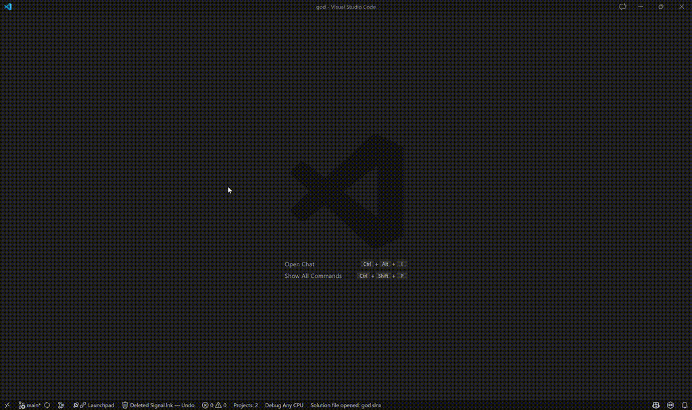

# vscode-dired

Fork of https://github.com/shirou/vscode-dired — a lightweight, keyboard-first
directory editor for VS Code inspired by Emacs dired.



## Quick summary
- Keyboard-driven file manager inside a read-only editor buffer.
- Create, delete, rename, and copy files and directories from the keyboard.
- Integrated terminal opens directly in the current Dired folder.

## Commands (single table)
Below is a consolidated list of contributed commands. Keybindings are shown
when a default is provided by the extension — they can be customized in
VS Code keyboard shortcuts.

| Command | Command ID | Default keybinding | Description |
|---|---|---|---|
| Open Dired / open directory | `extension.dired.open` | `ctrl+x d` | Open a directory in Dired |
| Open integrated terminal (in folder) | `extension.dired.openTerminal` | `ctrl+x t` | Open the integrated terminal scoped to the current Dired folder |
| Create file | `extension.dired.createFile` | `ctrl+x ctrl+n f` | Create a new file in the current Dired directory (created but not opened) |
| Create directory | `extension.dired.createDir` | `ctrl+x ctrl+n d` | Create a new directory in the current Dired directory |
| Find in folder | `extension.dired.findInFolder` | `ctrl+x f` | Open Find-in-Files scoped to the current Dired folder or selected file's parent |
| Copy full path | `extension.dired.copyPath` | `ctrl+x ctrl+p` | Copy the full path of the selected row (or current directory when on header) |
| Copy name | `extension.dired.copyName` | `ctrl+x p` | Copy the filename of the selected row |
| Toggle dotfiles | `extension.dired.toggleDotFiles` | `ctrl+x .` | Show/hide hidden files |
| Toggle meta files | `extension.dired.toggleMetaFiles` | — | Toggle display of `.meta` (Unity-style) metadata files |
| Rename | `extension.dired.rename` | — | Rename the selected file or folder |
| Copy selected | `extension.dired.copy` | `alt+w` | Copy selected files/folders |
| Delete selected | `extension.dired.delete` | `ctrl+x shift+d` | Delete selected file(s)/folder(s) (tries to use OS Trash/Recycle Bin) |
| Go up / parent directory | `extension.dired.goUpDir` | `ctrl+b` | Navigate to the parent directory |
| Refresh listing | `extension.dired.refresh` | `ctrl+x r` | Refresh the directory listing |
| Select / Unselect | `extension.dired.select` / `extension.dired.unselect` | — | Select or unselect the current file |
| Close Dired buffer | `extension.dired.close` | — | Close the active Dired buffer |
| Undo last action | `extension.dired.undoLastAction` | — | Undo the last create/delete action when available (status-bar provides quick access) |
| Debug link ranges | `extension.dired.debugLinkRanges` | — | Debug helper: writes computed link start columns into the Dired debug output channel |

## Delete & Undo
- Deletes attempt to move items to the OS Trash/Recycle Bin when available and
	the extension keeps a temporary backup so the last action can be undone.
- A persistent status-bar item shows the last action and provides quick access
	to `Dired: Undo Last Action` (`extension.dired.undoLastAction`).

## Development
- Watch & debug (recommended):

```powershell
npm run watch
```

- One-off compile:

```powershell
npm run compile
```

- Package vsix:

```powershell
npm run package
```

Tasks: `.vscode/tasks.json` includes `npm: watch`, `npm: compile`, `npm: test`, `npm: package`.

## License
Apache-2.0

---